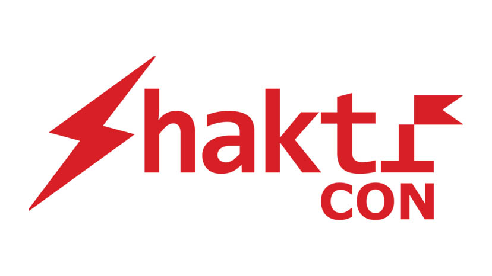

# Feztia - Event Management Suite for Universities 

**👓 Live Preview**: [https://events.amritauniversity.info](https://events.amritauniversity.info)

Feztia is an all-in-one event management suite for universities and institutions to organize their events hassle-free!

## ✨ Features
- **Manual & Automatic Registration Approval System**
- **Contest Submissions** - Participants can submit their entries (doc, video, photo, audio) towards an event
- **Submission Gallery** - Gallery (News Feed) showing all entries by participants
- **Email & SMS Verification** Supported
- **Sub-Events** - Events can have sub-events each having full features of the parent event
- **Admin Panel** - Powerful Admin Panel with support for exporting data as CSV/Excel
- **Team Events** - Participants can form teams and participate in contests
- **Judging Panel** - Judges can rate participant entries, eliminate contestants and declare winners.
- **Bulk Emailing** - Bulk email participants, with custom filters about updates on the event.
- **Certificate Generation** - Automatic Certificate Generation - Participant & Merit Certificates. 

## 🕸 Our Clients
Feztia has already been used and proven to work at multiple international and national conferences, multi-fests 
and symposiums, and in total we have seen over 9k+ registrations happen through it.  

<table style="text-align: center">
    <tr>
        <td>
             
            <h6>Amrita Vishwa Vidyapeetham / (AoC)</h6>
        </td>
        <td>
            
            <h6>Amrita Biocrest</h6>
        </td>
        <td style="background: black; color: white">
            
            <h6>ShaktiCon</h6>
        </td>
        <td style="background: black; color: white">
            
            <h6>Vidyut</h6>
        </td>
    </tr>
</table>

## ⚡️Tech Stack

Feztia is powered by a modern web-stack, and runs as multiple dockerized microservices. 

<table style="text-align: center">
    <tr>
        <td>
            
            <h6>React (NextJS)</h6>
        </td>
        <td>
            
            <h6>GraphQL</h6>
        </td>
        <td>
            
            <h6>Django</h6>
        </td>
        <td>
            
            <h6>Javascript</h6>
        </td>
        <td>
            
            <h6>Python</h6>
        </td>
        <td>
            
            <h6>Postgres</h6>
        </td>
        <td>
            
            <h6>Docker</h6>
        </td>
    </tr>
</table>

## ✒️License
This project is licensed under the GNU General Public License V3.

---

Developed with  ♥ in 
